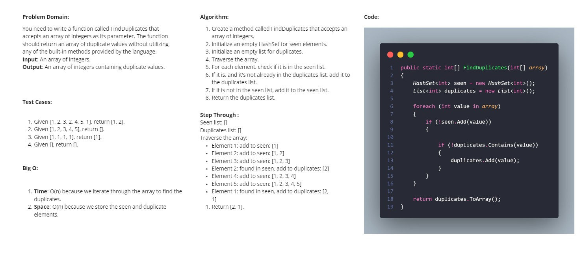

# Challenge Name: Find Duplicates in Array

## Challenge Description

This challenge involves writing a program that identifies all duplicate numbers in a given array. The program should output each duplicate number exactly once, regardless of how many times the number appears in the array. The solution provided demonstrates how to accomplish this using a `HashSet<int>` to track seen numbers and a `List<int>` to store and eventually return the duplicates.

## Whiteboard Solution

