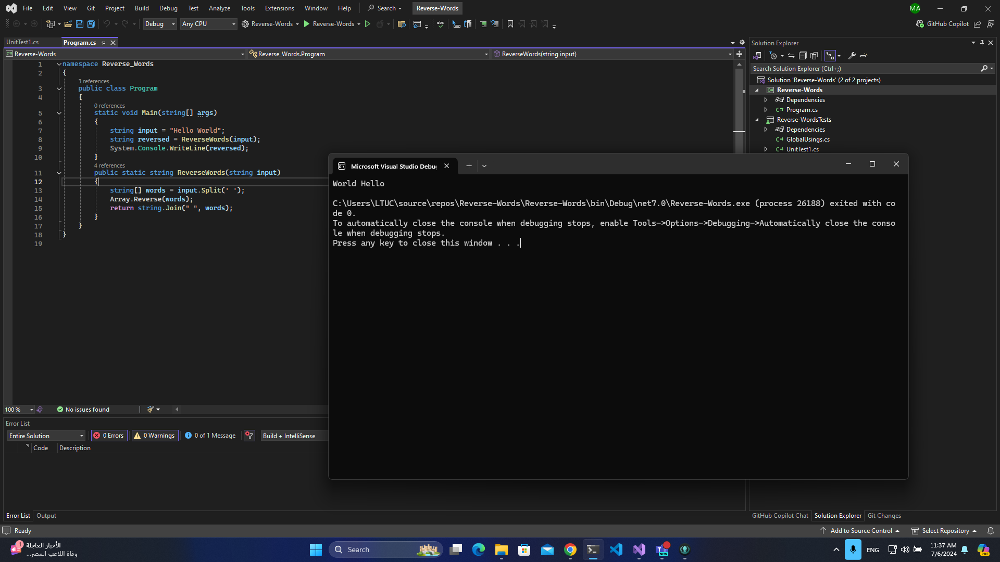

# Challenge Name: Reverse Words

## Challenge Description

The ReverseWords function is designed to take a single string parameter, input, which represents a sentence or a sequence of words separated by spaces, the function returns this newly constructed string, effectively reversing the order of words from the original input while preserving the original characters within each word.

## Screenshot

