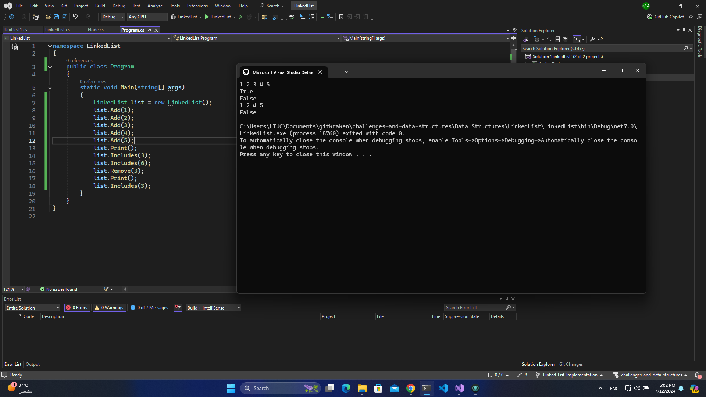

# Challenge Name: Linked List Implementation

## Challenge Description

This challenge focuses on the implementation of a singly linked list data structure from scratch. Participants are required to create a custom linked list that supports basic operations such as insertion, deletion, searching for an element, and traversing through the list to print all the elements. The goal is to understand the underlying mechanics of linked lists, including how nodes are connected and how operations are performed efficiently.

## Screenshot

