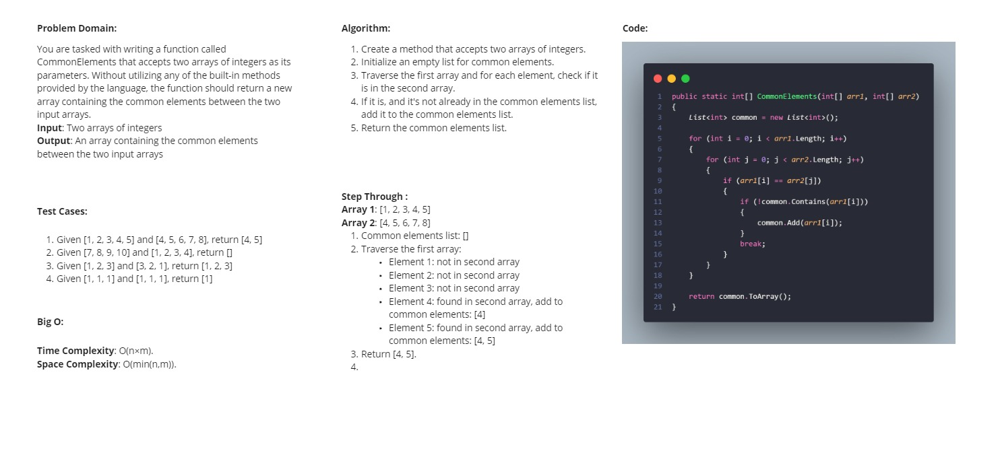
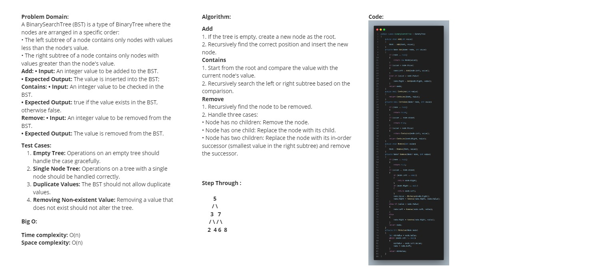

### Whiteboard Images

### Challenge A: Array Reversal

### Challenge B: Most Frequent Number

### Challenge 02: Maximum Value

### Challenge 03: Remove Middle Value

### Challenge 04: Insert Middle Value

### Challenge 05: Find-Duplicates

### Challenge 06-A: Common Elements

### Challenge 06-B: Reverse Words

### Challenge 07: Linked-List-Implementation

### Stack & Queue Implementation

### Reverse a Stack using Queue

### Delete Middle Element of a Stack

### Min Stack Challenge

### Tree Implementation

### Mirror Tree

### Second Maximum Value

### Binary Tree - Sum of leaf nodes

### Binary Tree - Largest Value at Each Level

### Linked List - Rotate by K

### Binary Tree - Print Right View

### Binary Tree - Level with Maximum Number of Nodes

### Binary Tree - Minimum Depth

